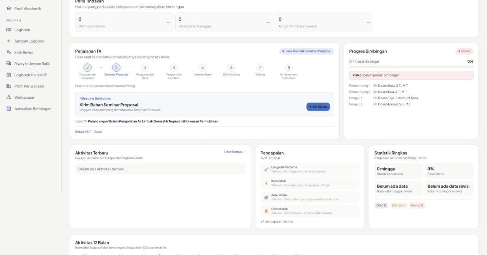

<div align="center">
  
  <h1>Logbook</h1>
  <p><strong>Bimbingan yang tertata, kemajuan yang terlihat.</strong></p>
  <p>Aplikasi pencatatan &amp; monitoring bimbingan <strong>Tugas Akhir (TA)</strong> dan <strong>Kerja Praktik (KP)</strong> — dari entri logbook pertama sampai sidang terakhir, mahasiswa dan dosen mencatat progres, memberi umpan balik, serta menuntaskan revisi dalam satu tempat.</p>
  <p>
    <a href="https://logbook.reloop.id">🌐 Live Demo</a> &nbsp;·&nbsp;
    <a href="docs/USER-GUIDE.md">📖 Panduan Pengguna</a> &nbsp;·&nbsp;
    <a href="docs/API.md">🔌 API</a> &nbsp;·&nbsp;
    <a href="CHANGELOG.md">🧾 Changelog</a>
  </p>
  <p>
    
    
    
    
    
    
  </p>
</div>

## Daftar isi

- [Pratinjau](#pratinjau)
- [Fitur utama](#fitur-utama)
- [Teknologi](#teknologi)
- [Menjalankan secara lokal](#menjalankan-secara-lokal)
- [Deployment dengan Docker Compose](#deployment-dengan-docker-compose)
- [Pengujian](#pengujian)
- [Dokumentasi](#dokumentasi)
- [Lisensi](#lisensi)

## 🖥️ Pratinjau



| Dashboard mahasiswa | Dashboard dosen |
| :---: | :---: |
|  |  |

> **Coba langsung:** [logbook.reloop.id](https://logbook.reloop.id) · belum punya akun? [Daftar gratis](https://logbook.reloop.id/register) atau baca [Panduan Pengguna](docs/USER-GUIDE.md).

## ✨ Fitur utama

### 🎓 Untuk mahasiswa

- 📝 **Logbook & revisi** — catat setiap sesi bimbingan, unggah dokumen, dan pantau status pengajuan secara real-time.
- 📄 **Review PDF inline** — anotasi dan komentar tepat pada bagian dokumen yang relevan (didukung PDF.js + React).
- 📂 **Ruang kerja dokumen** — simpan dan bagikan dokumen TA/KP (bab, revisi, lampiran) secara terpusat.
- 🎤 **Seminar & sidang** — kirim undangan dan materi seminar/sidang langsung ke dosen, plus finalisasi kelengkapan akhir (abstrak, cover, pengesahan).
- 💬 **Chat & pengumuman** — diskusi langsung dengan dosen dan terima pengumuman resmi.

### 👨‍🏫 Untuk dosen

- ✅ **Keputusan review** — setujui, minta revisi, atau arsipkan entri (catatan arsip opsional).
- 📥 **Antrean review** — dashboard ringkas berisi mahasiswa bimbingan dan antrean yang menunggu tindakan.
- 🗂️ **Catatan sidang & riwayat menguji** — dokumentasikan hasil sidang/pengujian per mahasiswa.
- 🔔 **Notifikasi & kesehatan bimbingan** — indikator keteraturan bimbingan dan pengingat otomatis.

### 🏛️ Untuk pengelola

- 👥 **Manajemen pembimbing & penguji** — kelola relasi bimbingan, alur seminar, sidang, hingga finalisasi TA/KP.
- 🔐 **Hak akses berbasis peran** — pemisahan data institusi dengan mode personal & institusi dalam satu deployment.
- 💾 **Backup & restore sistem** — pencadangan seluruh data dari panel admin.
- 📊 **Ekspor data** — unduh rekap dalam format Excel/PDF.

## 🛠️ Teknologi

| Lapisan | Teknologi |
| --- | --- |
| Backend | Laravel 11 · PHP 8.4 |
| Antarmuka | Blade · Tailwind CSS · React 19 · PDF.js |
| Database, cache & antrean | MySQL 8.4 · Redis 7 |
| Realtime | Laravel Reverb (WebSocket) |
| Server & deployment | Nginx · Docker Compose |

> Arsitektur detail, endpoint API, dan spesifikasi mode personal/institusi tersedia di folder [`docs/`](docs/USER-GUIDE.md).

## 🚀 Menjalankan secara lokal

### Prasyarat

| Kebutuhan | Versi |
| --- | --- |
| PHP | 8.4+ |
| Composer | 2.x |
| Node.js + npm | 20+ |
| Database lokal | SQLite (tanpa MySQL/Redis) |

### 1️⃣ Pasang dependensi

```bash
git clone https://github.com/relooplab/logbook.git
cd logbook
composer install
npm ci
cp .env.example .env
```

### 2️⃣ Konfigurasi `.env` untuk SQLite

Sesuaikan nilai berikut agar berjalan lokal tanpa MySQL atau Redis:

```dotenv
APP_ENV=local
APP_DEBUG=true
APP_URL=http://127.0.0.1:8000
DB_CONNECTION=sqlite
DB_DATABASE=database/database.sqlite
CACHE_STORE=file
SESSION_DRIVER=file
QUEUE_CONNECTION=sync
BROADCAST_CONNECTION=log
MAIL_MAILER=log
```

### 3️⃣ Siapkan database & jalankan

```bash
touch database/database.sqlite
php artisan key:generate
php artisan migrate --seed
php artisan storage:link
npm run build
php artisan serve
```

Buka <http://127.0.0.1:8000>. Saat mengubah antarmuka, jalankan `npm run dev` di terminal lain agar aset dimuat ulang otomatis.

## 🐳 Deployment dengan Docker Compose

Stack produksi terdiri dari layanan **app** (Laravel), **nginx**, **MySQL 8.4**, **Redis 7**, **Reverb** (WebSocket), **queue worker**, **scheduler**, dan **Mailpit** (hanya localhost).

### 1️⃣ Siapkan environment

Salin `.env.example` menjadi `.env`, lalu isi variabel wajib berikut dengan kredensial unik per lingkungan:

| Variabel | Keterangan |
| --- | --- |
| `APP_KEY` | Generate via `php artisan key:generate` — tanpa ini Laravel gagal boot |
| `APP_URL` | URL publik aplikasi |
| `DB_PASSWORD` / `MYSQL_ROOT_PASSWORD` | Kredensial database |
| `REVERB_APP_ID` / `REVERB_APP_KEY` / `REVERB_APP_SECRET` | Kredensial WebSocket |

> 🔒 Jangan pernah commit file `.env` ke Git.

### 2️⃣ Jalankan stack

```bash
cp .env.example .env
# Lengkapi .env terlebih dahulu, lalu:
docker compose config --quiet
docker compose up -d --build
docker compose exec logbook-ta-app php artisan migrate --force
docker compose ps
```

### Checklist produksi

- [ ] Gunakan reverse proxy HTTPS dan tetapkan `APP_DEBUG=false`
- [ ] Konfigurasi SMTP produksi via variabel `MAIL_*`
- [ ] Port Mailpit tetap terikat ke localhost — jangan dibuka ke internet
- [ ] Cadangkan database dan berkas sebelum migrasi/deployment

Rincian seluruh variabel tersedia di [`.env.example`](.env.example).

## 🧪 Pengujian

```bash
php artisan test
```

> ⚠️ Gunakan **database pengujian terpisah** — jangan arahkan test suite ke database produksi.

## 📚 Dokumentasi

| Dokumen | Isi |
| --- | --- |
| [📖 Panduan Pengguna](docs/USER-GUIDE.md) | Alur kerja lengkap per peran (Bahasa Indonesia) |
| [📖 User Guide](docs/USER-GUIDE-EN.md) | English version of the user guide |
| [🔌 API](docs/API.md) | Referensi endpoint chat & pengumuman |
| [🧩 Mode personal/institusi](docs/MODE-SPEC.md) | Spesifikasi mode aplikasi |
| [📝 Glosarium](docs/GLOSSARY.md) | Istilah domain TA/KP |
| [🧾 Changelog](CHANGELOG.md) | Riwayat rilis |

## 📄 Lisensi

Kode ini menggunakan [**Business Source License 1.1**](LICENSE) — **bukan lisensi open source**.

- ✅ Penggunaan produksi **personal** (non-institusional) diizinkan sesuai ketentuan lisensi
- 🏛️ Penggunaan produksi **oleh/untuk institusi** memerlukan lisensi komersial terpisah
- 📧 Pertanyaan lisensi: [dev@reloop.id](mailto:dev@reloop.id)

---

<div align="center">
  <p>Dibangun dengan ❤️ oleh <a href="https://reloop.id"><strong>ReLoop Lab</strong></a> — Bimbingan yang tertata, kemajuan yang terlihat.</p>
  <p><a href="#readme">⬆ Kembali ke atas</a></p>
</div>
